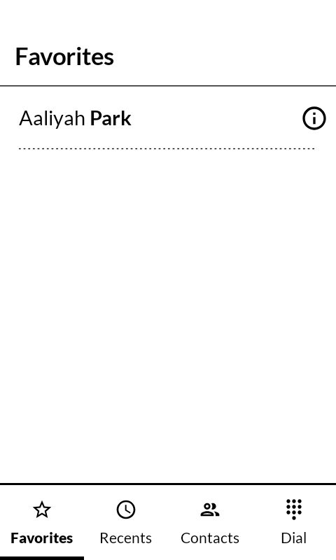
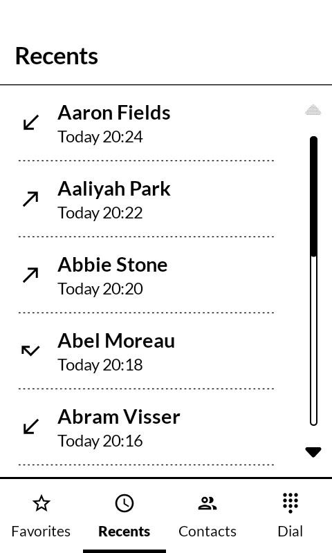
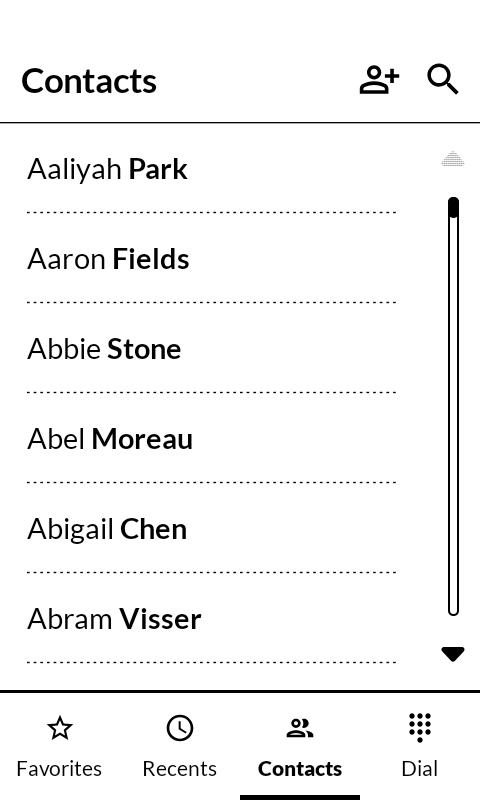
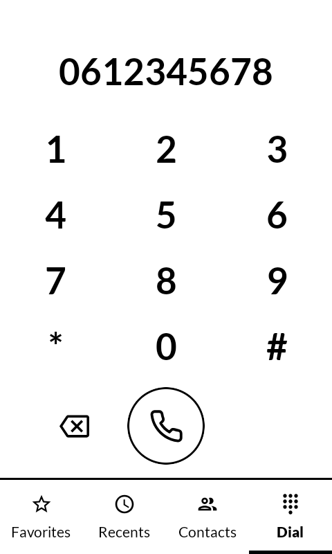

# MonoPhone

A phone app for the Mudita Kompakt, built with MMD (Mudita Mindful Design). It shows on your launcher as "Phone". The app recreates the stock MuditaOS dialer so it can be used on Kompakts running other Android systems (like LineageOS), where the stock app cannot place calls.

It has four tabs, the same as the original: Favorites for one-tap calling of starred contacts, Recents for your call history, Contacts for browsing and searching the address book, and Dial for the keypad. Calls go through Android's normal telephony, and the in-call screen is the one from your system's default phone app. Nothing leaves the device; the app has no internet access at all.

  
  
  
  

## What it does

Tapping a favorite calls them directly; the info button opens them in your contacts app. Recents shows who called, when, and whether the call was incoming, outgoing, missed or blocked; tapping an entry calls back. The Contacts tab opens a contact in your contacts app, and has shortcuts for adding and searching. The keypad dials any number, long-press 0 for +. With the keypad empty, long-press 1 to call your voicemail; if your SIM does not share a voicemail number, the app asks for it once and remembers it. The 1 key carries a small voicemail symbol as a reminder, like on classic phones; when your carrier reports a waiting voicemail, a dot appears next to it and on the Dial tab icon. Other apps that ask to dial a number (links in a browser, for example) can open MonoPhone with the number prefilled.

## Install

Download the latest APK from the [releases page](../../releases) and sideload it,
or build from source:

    ./gradlew installDebug

On first start the app asks for contacts, call history and phone access; the first two are what the tabs show, phone access is for the voicemail indicator. The first call also asks for calling permission.

## Structure

- `MainActivity.kt` - the four tabs, bottom navigation and call permission handling
- `PhoneViewModel.kt` - contact and call log state, watches both for changes
- `data/PhoneRepository.kt` - reads contacts and the call log from Android's providers
- `ui/FavoritesTab.kt` - starred contacts with one-tap calling
- `ui/RecentsTab.kt` - call history with direction icons and times
- `ui/ContactsTab.kt` - contact list with search and add shortcuts
- `ui/DialTab.kt` - the keypad
- `ui/PermissionScreen.kt` - first-run access request
- `ui/VoicemailNumberSheet.kt` - asks for the voicemail number when the SIM has none
- `ui/Components.kt` - dotted divider and shared styling

## Support

If you find this app useful, consider [sponsoring me](https://github.com/sponsors/berendsliedrecht).

## License

[MIT](LICENSE)
